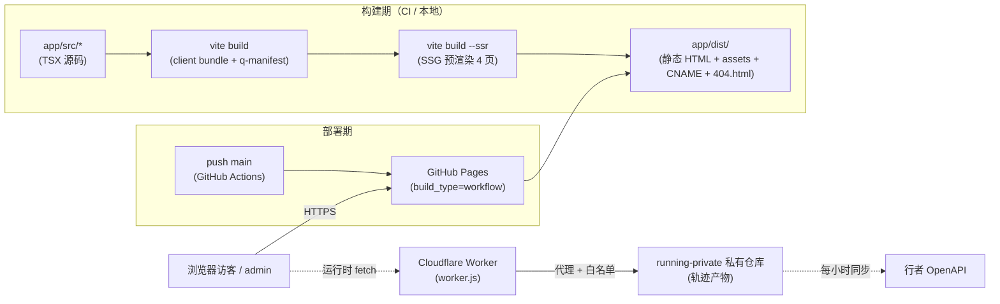
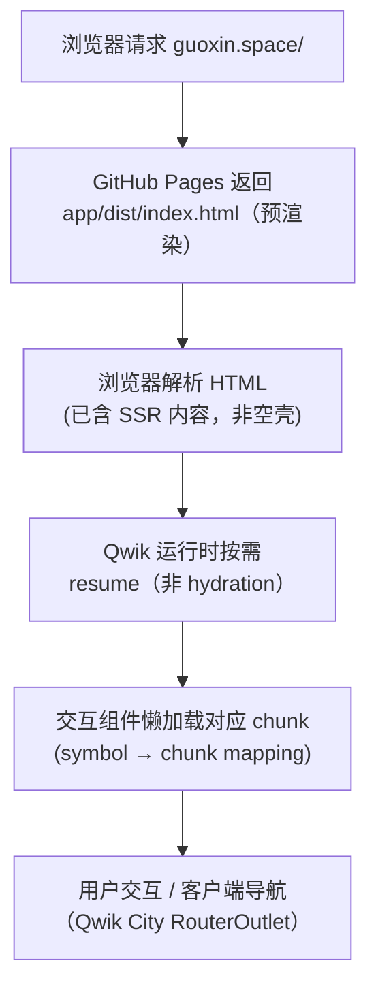
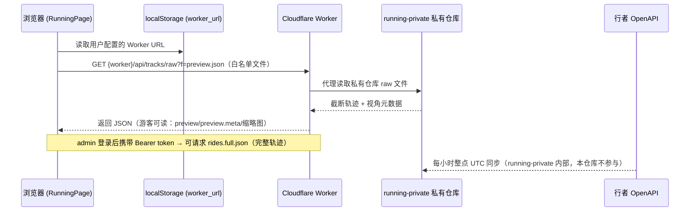
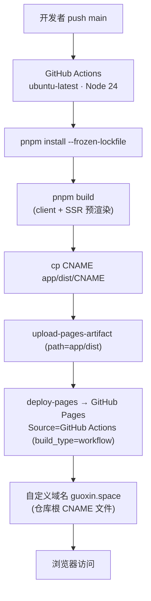

# guoxin.space 架构文档

> 让新接手者 / AI Agent 在 10 分钟内形成本项目的心智模型。
> 架构级变更（模块拆分、入口替换、并发模型变化、关键依赖增减）时同步更新。

> Source: `app/src/`（root.tsx / entry.ssr.tsx / entry.dev.tsx / routes/ / components/ / lib/）、`vite.config.ts`、`package.json`、`.github/workflows/deploy.yml`、`DESIGN.md`
> Last-verified: 2026-09-12

---

## 系统定位

个人主页 / 工作台站点（Personal Homepage + Toolbox + Skills + Running 数据展示），托管于 GitHub Pages（自定义域名 `guoxin.space`）。形态为 **Qwik + Qwik City 的 SSG 静态预渲染站点**：构建期把 4 个顶层页面预渲染为纯静态 HTML，运行时通过 Qwik 的 resumability 进行客户端激活，全站**无后端、无数据库**。面向两类用户——访客（浏览 Skills / 使用 JSON 工具 / 查看骑行公开轨迹）与管理员（GitHub OAuth 登录后可读完整轨迹）。

---

## 总体视图



- 实线 = SSG 主链路（构建→部署→直接访问）；虚线 = 运行时按需触发的外部数据链路（仅 Running 模块，且依赖用户在「通道设置」里填写的 Worker URL）。
- 说明：部署在 `deploy.yml` 中**无手动闸门**——`push main` 即触发 build + `deploy-pages` 上线（`on: push: branches: [main]`，`workflow_dispatch` 仅作应急手动入口）。

---

## 模块划分

| 模块 | 职责 | 入口文件 | 主要依赖 |
|------|------|---------|---------|
| 应用外壳 / 路由 | Qwik City 根组件、布局、页面路由、Service Worker 注册 | `app/src/root.tsx`、`app/src/routes/layout.tsx`、`app/src/routes/*` | `@builder.io/qwik-city` |
| 视觉组件 | 像素图标基因集、终端命令框、Header / Footer / RouterHead | `app/src/components/pixel/PixelIcon.tsx`、`app/src/components/pixel/TerminalBox.tsx`、`app/src/components/layout/*`、`app/src/components/skills/*`、`app/src/components/running/*`、`app/src/components/json/*`、`app/src/components/auth/*` | Tailwind 3.4 + `global.css` |
| 全局样式 / 设计系统 | `--container-w` 版面宽度开关、`.btn` 基类、主题变量、偏移实心阴影规范 | `app/src/global.css`（设计真源为根 `DESIGN.md`） | Tailwind + PostCSS + 自托管字体 |
| 业务逻辑库 | auth（OAuth 态判定）、json 工具（解析/格式化/对比/jsonpath/history）、running（轨迹解析/统计）、skills（技能夹解析/渲染）、worker 通道封装、storage、clipboard、format、html | `app/src/lib/*.ts`（含 `json/` 子目录） | `@ltd/j-toml`、`fast-xml-parser`、`js-yaml`、`json5`、`jsonpath-plus`、`marked` |
| 构建配置 | Vite root=app、Qwik optimizer、static adapter（origin=guoxin.space）、manifest 注入（规避本机临时 manifest 未落盘导致 SSG 空壳） | `vite.config.ts` | `@builder.io/qwik/optimizer`、`@builder.io/qwik-city/adapters/static/vite` |
| 页面入口 | SSR 渲染入口、dev 渲染入口、preview 入口 | `app/src/entry.ssr.tsx`、`app/src/entry.dev.tsx`、`app/src/entry.preview.tsx` | `@builder.io/qwik/server` |
| Cloudflare Worker（外部运行时） | OAuth 鉴权 + 收藏写通道 + 私有轨迹仓库代理（白名单 `TRACKS_FILES`） | 仓库根 `worker.js`（无独立单测） | Cloudflare Workers 运行时；**注意**：不在 `deploy.yml` 内，部署链路见 TODO |
| 数据生产（独立仓库） | 从行者 OpenAPI 同步 → 补全 polyline → 生成预览/缩略图/完整轨迹产物 | 仓库 `GuoxinL/running-private`（**不在本仓库**） | 行者 OpenAPI、GitHub raw |

---

## 典型流程

### 流程 A：SSG 页面访问（读，主链路）



- 关键点：HTML 在构建期已由 `vite build --ssr` 预渲染，包含真实内容；客户端**不需重跑整套 hydration**，而是对交互点做 resumability（见下节）。

### 流程 B：Running 轨迹数据读取（读，外部链路）



### 流程 C：构建产物生成（写，CI）

`push main` → `pnpm install --frozen-lockfile` → `pnpm build`（`vite build` 产出 client bundle + `q-manifest.json`，随后 `vite build --ssr` 用该 manifest 预渲染 4 页）→ `cp CNAME app/dist/CNAME` → `upload-pages-artifact` → `deploy-pages`。详见「部署 / 分发拓扑」。

---

## 并发 / 性能 / 资源模型

- **无服务端进程**：站点纯静态，无长驻进程 / 线程 / 数据库。所有"计算"发生在构建期（Node 进程预渲染）与浏览器端（JS 主线程）。
- **Qwik Resumability，而非 Hydration**：这是本项目的核心并发/性能模型。传统框架（React/Vue）在客户端需要下载框架运行时并对整棵组件树做 hydration（重放事件绑定、重建虚拟 DOM 状态），成本随组件数线性增长。Qwik 改为 **resumability**——预渲染 HTML 已含服务端序列化状态（`q:` 属性 + `q-manifest.json` 的 symbol→chunk 映射），客户端**不重跑框架初始化**，只在用户真正与某个交互点（如按钮点击）交现时，才懒加载并执行该交互对应的极小 chunk。因此首屏 JS 体积与交互延迟与组件总数解耦。
- **事件绑定用「惰性恢复」**：`useVisibleTask$` / `onClick$` 等以 `$` 结尾的 Qwik 函数为"可恢复"边界；未触达的交互永不下载其代码。
- **单线程约束**：浏览器端为单 JS 线程；重计算（JSON 格式化/对比、轨迹解析）应尽量保持纯函数并放在 `app/src/lib/*` 便于单测，避免阻塞主线程（如大 JSON 解析的体验问题<!-- TODO(sop.init): 是否已有 Web Worker / 分块解析优化？未在代码中发现，待确认 -->）。
- **预渲染期 manifest 坑（已修复）**：本机环境下 Qwik 的临时 manifest 文件未落盘，会导致 SSR 侧 `manifestInput` 为空、整页渲染空壳（`q:container="paused"`）。`vite.config.ts` 已显式从 `app/dist/q-manifest.json` 读取并注入，构建期必须先跑 client build 再跑 SSR build。

---

## 数据流（含 SSG 预渲染与运行时 hydration）

### 1. 页面内容链路（构建期 → 运行时）

```
app/src/routes/*.tsx + components + global.css + lib
        │  (vite build --ssr, 注入 q-manifest)
        ▼
app/dist/<route>.html   ← 含真实预渲染内容 + q: 属性 + 脚本引用
        │  (GitHub Pages 直接托管)
        ▼
浏览器：解析 HTML → Qwik resume（按需懒加载 chunk） → 客户端导航(SPA 式)
```

- 页面内容在**构建期**确定；除 Running 外，Skills / JSON 工具的"数据"多为本地静态资源或运行时浏览器内计算，**不经过任何服务端**。

### 2. Running 数据链路（运行时，外部）

```
行者 OpenAPI ──(每小时整点 UTC, running-private 内 xz-sync)──▶ running-private 仓库
                                                              (preview.json / preview.meta.json
                                                               / rides.full.json / previews/ / thumb/)
                                                              │
浏览器 (localStorage: worker_url) ──GET /api/tracks/raw?f=<白名单文件>──▶ Cloudflare Worker (worker.js)
                                                              │                       │
                                                              │◀──── 代理 + 鉴权 ──────┘
                                                              ▼
                                              游客：preview / meta / 缩略图
                                              admin（Bearer）：rides.full.json（完整轨迹）
```

- 链路要点：本仓库**只持有 Worker 源码（worker.js）与前端调用封装（lib/worker.ts）**，不持有数据生产过程；数据生产完全在 `running-private`。改数据链路请改 `running-private` 仓库，勿改本仓库（参见 AGENTS.md 红线 10）。

---

## 关键设计决策

| # | 决策 | 备注 / Why |
|---|------|------|
| 1 | 选用 **Qwik + Qwik City** | resumability 使首屏 JS 与组件规模解耦，适合"内容站 + 少量交互"，且原生支持 SSG。 |
| 2 | **SSG 静态预渲染**（static adapter，origin=guoxin.space） | 4 个顶层页面构建期产出纯 HTML，可直接被 GitHub Pages / 任意静态托管；零服务器成本、CDN 友好、SEO 友好。 |
| 3 | **无后端 / 无数据库** | 个人站点内容静态即可承载；任何需服务端的能力（鉴权、私有数据代理）外移到 Cloudflare Worker，避免维护服务器。 |
| 4 | Vite `root` 指向 `app/`，与旧站根 `index.html` 隔离 | 重构期彻底隔离旧静态文件，新代码只进 `app/src/`。 |
| 5 | 设计真源 = 根 `DESIGN.md`，同步到 `app/src/global.css` | 单一视觉真相源，避免组件各自写死样式；`.btn` 基类全局共用（Skills/JSON/Running 28 处），版面宽度只改 `--container-w` 一处。 |
| 6 | 像素图标用 `PixelIcon.tsx`（16×16 纯矩形 path）取代图标库 | 品牌"街机像素基因"，零第三方图标依赖，明暗靠 opacity 层次。 |
| 7 | Running 数据走 Worker 代理 + 白名单，不直连 raw URL | 私有仓库隔离 + 鉴权（游客/游客截断数据 vs admin 完整轨迹），前端不从公开 URL 拉数据。 |
| 8 | 包管理统一 **pnpm 9.15**（禁用 npm/yarn，禁提交 lock 外的 `package-lock.json`） | 与 `packageManager: pnpm@9.15.0` 一致，避免 CI `ERR_PNPM_BAD_PM_VERSION`。 |
| 9 | CI 必须 **Node ≥24**（本地 engines 标注 ≥20） | `undici@8` 依赖 `util.markAsUncloneable`，Node 20/22 缺该 API 会令 `pnpm build` 失败。 |
| 10 | Service Worker 注册（`ServiceWorkerRegister`） | 客户端导航/缓存增强；具体缓存策略<!-- TODO(sop.init): 确认 service-worker 的缓存/更新策略与版本号 -->。 |

---

## 部署 / 分发拓扑



- **托管**：GitHub Pages，`Pages Source = GitHub Actions`（非 branch deploy）。CNAME 由 CI `cp CNAME app/dist/CNAME` 注入产物根，绑定 `guoxin.space`。
- **产物**：`app/dist/`（4 页预渲染 HTML + 静态资源 + `404.html` 由 SSG 生成 + CNAME）。
- **CI 约束**：两个 workflow（`deploy.yml`、`check-404-sync.yml`）均须 `node-version: 24`，且**不给 `pnpm/action-setup` 写死 `version`**（与 `packageManager` 字段冲突）。
- **回滚**：AGENTS.md 记录可在 Pages Source 切回 `branch deploy` 秒级恢复旧站（本流程默认走 Actions 自动发布）。
- **本地构建坑**：WorkBuddy 的 safe-delete guard 会拦截 vite 清空 `app/dist/`（文件数 > 50），需 `export CODEBUDDY_SAFE_DELETE_ENABLED=0`；本机无全局 pnpm 时可用 `npm run build` 代替（不生成 lock）。

### 外部依赖

| 依赖 | 角色 | 部署 / 位置 | 备注 |
|------|------|------------|------|
| **GitHub Pages** | 静态托管 + 自定义域名 | `.github/workflows/deploy.yml` 经 `deploy-pages` | Source=GitHub Actions |
| **Cloudflare Worker** | Running 数据代理 + OAuth 鉴权 | 仓库根 `worker.js`（Cloudflare 平台部署，**不在本仓库 CI**） | 部署流水线 <!-- TODO(sop.init): 确认 Worker 的 wrangler 部署配置/环境/Secret 注入位置（TRACKS_REPO、XINGZHE_* 等） --> |
| **行者 OpenAPI** | 骑行/跑步原始数据上游 | 由 `running-private` 仓库每小时同步 | 本仓库不直接调用，凭据在 running-private 的 Secret 中 |
| **running-private（私有仓库）** | 轨迹数据生产与产物存储 | `GuoxinL/running-private` | 白名单文件：`preview.json` / `preview.meta.json` / `rides.full.json` / `previews/` / `thumb/` |
| **pnpm / Node 24** | 构建工具链 | CI + 本地 | 见决策 8、9 |

---

## 待核实项（TODO）

- <!-- TODO(sop.init): `/skills/[dir]` 动态路由的 SSG 预渲染策略——因 dir 列表来自运行时 Worker，构建期未知，需确认该子页是否预渲染、直接 URL 访问行为（是否依赖 404.html 客户端路由回退），以及 `routes` 导出或 crawl 配置。 -->
- <!-- TODO(sop.init): Cloudflare Worker 的独立部署流水线与 wrangler 配置位置（worker.js 在仓库根，但不在 deploy.yml，需确认如何/在哪发布到 Cloudflare）。 -->
- <!-- TODO(sop.init): running-private 仓库内部 workflow（xz-sync.js / xz-fill.js / prebuild-preview.js 等）的详细链路与 Secret 名称，本仓库未含其源码，详见该仓库 docs。 -->
- <!-- TODO(sop.init): vitest 7 文件 / 110 用例的精确分布与覆盖率（lib 下 7 个 *.test.ts 已核实，110 用例数引自 AGENTS.md，待实测确认）。 -->
- <!-- TODO(sop.init): Service Worker 的缓存与更新策略（是否 SPA 导航 fallback、资源缓存 TTL）。 -->
- <!-- TODO(sop.init): 大 JSON 解析/轨迹解析是否存在 Web Worker 或分块优化（客户端主线程阻塞风险）。 -->
