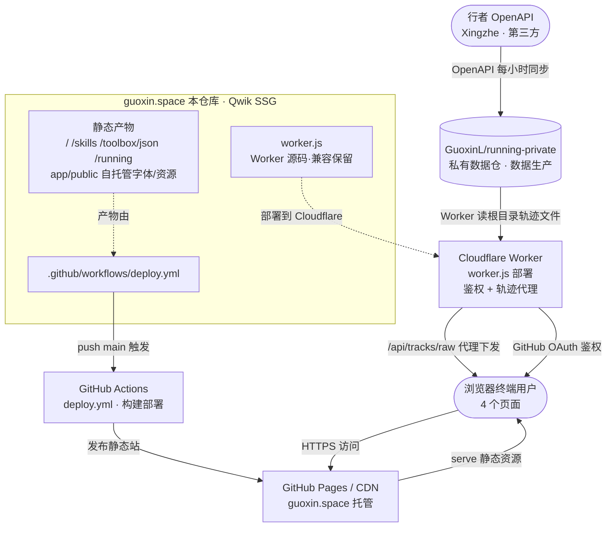

# 上下游 / 集成关系

> 本项目与外部世界的关系：谁在用它、它依赖了谁、依赖坏掉会怎样。
> 引入新外部依赖、调整调用拓扑、修改集成方式时同步更新。

> Source: app/src/lib/worker.ts、app/src/lib/auth.ts、app/src/lib/skills.ts、app/src/components/running/RunningPage.tsx、worker.js、.github/workflows/deploy.yml、running-private/.github/workflows/xingzhe_sync.yml
> Last-verified: 2026-09-12

---

## 上游（谁在用本项目）

| 调用方 / 集成方 | 代码仓库 | 用途 | 协议 / 集成方式 | 关键入口 | 联系人 |
|-----------------|---------|------|-----------------|---------|-------|
| 无外部系统主动集成（终端静态站） | — | 本仓库为面向终端用户的静态站，无后端服务被其它系统调用 | — | — | — |

> 本仓库仅由**浏览器终端用户**直接消费（见「下游」），不对外暴露可被程序化调用的 API/SDK/RPC。

---

## 下游（本项目用了谁）

| 被调方 / 被依赖方 | 代码仓库 | 用途 | 协议 / 集成方式 | 关键入口 | SLA / 版本约束 | 失败处理（超时 / 重试 / 降级）| 集成代码位置 |
|-------------------|---------|------|-----------------|---------|---------------|------------------------------|--------------|
| Cloudflare Worker（轨迹代理 + 鉴权） | 源码 `guoxin.space/worker.js`；运行于 Cloudflare（独立服务） | Running 轨迹下发；Skills 的 GitHub OAuth 鉴权与写通道 | HTTPS / JSON API：`/api/tracks/raw?f=<file>`、`/api/auth/*` | 默认 `https://skillboard-collect.lgx31.workers.dev`（SK_DFLT_WORKER）；URL 存 localStorage | 无显式 SLA（Cloudflare Free）；`rides.full.json` 需 Bearer | 前端捕获异常 → 错误提示；**无数据缓存兜底**（见故障矩阵） | `app/src/lib/worker.ts`、`app/src/lib/auth.ts`、`app/src/lib/skills.ts` |
| GuoxinL/running-private（私有数据仓） | github.com/GuoxinL/running-private | Running 轨迹数据生产：存放 xingzhe_sync 生成的轨迹产物 | Worker 经 GitHub Contents API 读根目录文件（白名单校验） | 仓根目录 4 个轨迹产物（preview / preview.meta / rides.full 等） | 私有仓；无 SLA | 同步失败 → 轨迹陈旧，站点无报错 | `running-private/.github/workflows/xingzhe_sync.yml` |
| 行者 OpenAPI（Xingzhe） | 第三方 `imxingzhe.com` | Running 原始骑行/跑步轨迹来源 | HTTPS REST（OAuth2 client/refresh） | `running-private` 同步脚本 | 第三方；**有限流**；凭证（refresh_token）每次刷新轮换 | 限流/失效 → 同步中断 | `running-private/.github/workflows/xingzhe_sync.yml`（Secret `XINGZHE_CREDENTIALS_JSON`） |
| GitHub Actions（部署） | `guoxin.space/.github/workflows/deploy.yml` | 构建 + 发布到 GitHub Pages | GitHub Actions（`push main` 触发） | `deploy.yml` | GitHub 平台 SLA | 失败 → 线上不更新，旧版继续服务 | `.github/workflows/deploy.yml` |
| GitHub Pages / CDN | github.io Pages + 自定义域名 guoxin.space | 静态托管 | HTTPS 静态资源 | 仓库根 `CNAME` | GitHub Pages SLA | 故障 → 全站不可达 | `deploy.yml` 注入 `CNAME` |
| 自托管字体 / 资源 | 本仓库 `app/public/fonts`、`app/public/img` | 字体 / 图片（无第三方运行时请求） | 同源静态资源 | `app/public` | 无外部依赖 | 缺失 → 浏览器字体回退 | `app/public` |

> **旧仓库**：`GuoxinL/running`（公开）已废弃，数据生产迁至 `running-private`。

---

## 调用关系说明

### 1. Running 轨迹下发链（浏览器 → Worker → running-private）

- **触发场景**：用户访问 `/running` 页（游客看预览，admin 额外看完整轨迹）。
- **调用拓扑**：`<浏览器 /running>` ─→ `<Cloudflare Worker /api/tracks/raw?f=preview.json>` ─→ `<running-private 根目录轨迹文件>` ─→ 返回 JSON ─→ `<RunningPage 渲染>`
- **传输数据**：轨迹预览 JSON（`preview.json` / `preview.meta.json`）；admin 额外拉取 `rides.full.json`（需 `Bearer` 鉴权）。文件走 Worker 白名单。
- **关键代码**：`app/src/lib/worker.ts`（`tracksRawUrl` / `TRACK_FILES`）、`app/src/lib/running.ts`（`rkFetchPreview` / `rkLoadRides`）、`app/src/components/running/RunningPage.tsx`（取数 `useVisibleTask$`）。
- **失败影响**：Worker 不可达 → 全模块空白 + 错误提示；running-private 同步失败 → 轨迹陈旧但不报错。
- **相关文档**：`worker.js`（路由与白名单）、`running-private/README.md`。

### 2. Skills 鉴权 / 写通道链（浏览器 → Worker → GitHub OAuth）

- **触发场景**：用户在 `/skills` 的「通道设置」填写 Worker URL、`collect`/`remove`/`sync` 收藏操作、或 admin 登录。
- **调用拓扑**：`<浏览器 /skills>` ─→ `<Cloudflare Worker /api/auth/login>` ─→ `<GitHub OAuth>` ─回跳→ `<Worker /api/auth/callback>` ─→ `<Worker /api/auth/me 校验>`；写通道 `<POST /api/collect|remove|sync>`。
- **传输数据**：OAuth code/state、Bearer token、收藏 URL+mode（proxy/mirror）。
- **关键代码**：`app/src/lib/auth.ts`（`authWorkerUrl` / `authLogin` / `authMe`）、`app/src/lib/skills.ts`（默认 Worker `SK_DFLT_WORKER`）、`app/src/components/skills/*`。
- **失败影响**：Worker 故障 → 通道设置/收藏/登录不可用；仅影响 Skills 模块，不波及其它页面。
- **相关文档**：`worker.js`（`/api/auth/*` 路由）、`AGENTS.md`。

### 3. 数据生产链（离线 / 定时，行者 → running-private → Worker）

- **触发场景**：`running-private` 的 `xingzhe_sync.yml` 每小时整点（UTC `0 * * * *`）自动运行。
- **调用拓扑**：`<行者 OpenAPI>` ─→ `<running-private xingzhe_sync.yml>` ─提交轨迹产物→ `<running-private 仓根>` ─Worker 读取→ `<Cloudflare Worker>`。
- **传输数据**：骑行活动列表 / 轨迹点（脱敏后存私有仓，不落地到本仓库）。
- **关键代码**：`running-private/.github/workflows/xingzhe_sync.yml`（依赖 Secret `XINGZHE_CREDENTIALS_JSON`，可选 `XINGZHE_PAT`）。
- **失败影响**：行者限流 / 凭证失效 → 同步中断 → 轨迹陈旧；无自动告警。
- **相关文档**：`running-private/README.md`、`running-private/AGENTS.md`。

### 4. 部署链（push main → GitHub Actions → Pages）

- **触发场景**：`git push` 到 `main`（或 `workflow_dispatch`）。
- **调用拓扑**：`<push main>` ─→ `<deploy.yml build（pnpm install + pnpm build）>` ─→ `<upload-pages-artifact>` ─→ `<deploy-pages>` ─→ `<GitHub Pages / guoxin.space>`。
- **传输数据**：构建产物（`app/dist`）+ 补齐 `CNAME`。
- **关键代码**：`.github/workflows/deploy.yml`。
- **失败影响**：build 报错 → 线上不更新（旧版继续服务）；deploy-pages 故障 → 全站不可达。
- **相关文档**：`deploy.yml` 头部注释（回滚：Pages Source 切回 branch deploy）。

---

## 拓扑图

> 注：Worker URL 存于浏览器 `localStorage`（键 `worker_url`），构建期无法取值，所有数据/鉴权请求仅能在客户端发起（`app/src/lib/worker.ts`）。

---

## 故障传播矩阵

| 下游 / 外部条件 | 受影响功能 | 失败表现 | 是否可降级 | 降级 / 兜底方案 |
|----------------|-----------|---------|-----------|----------------|
| Cloudflare Worker 故障（代理/鉴权不可用） | Running `/running` 轨迹模块；Skills 写通道与登录 | `RunningPage` 捕获异常 → `state.err=true` → 提示「无法连接数据源（Cloudflare Worker 代理）。请检查网络后刷新页面重试」；游客轨迹空白、admin 无完整轨迹；Skills 通道设置/收藏不可用 | 部分降级（仅提示，无数据兜底） | **真实 fallback**：前端错误提示 + 用户刷新重试（`RunningPage.tsx:93-96,161-163`）。数据缓存兜底：**TODO**（可缓存最后成功快照到 localStorage/IndexedDB，断网时展示陈旧数据） |
| running-private 同步失败（xingzhe_sync.yml 失败/未运行） | Running 轨迹新鲜度 | 轨迹数据陈旧（停留在上次成功同步）；站点无报错，照常可访问 | 可（数据陈旧但可用） | 无自动告警/回滚。TODO（加同步失败通知 + 页面展示数据「最后更新时间」/新鲜度提示） |
| 行者 OpenAPI 限流 / 凭证失效（refresh_token 轮换未回写） | running-private 同步 → 轨迹新鲜度 | 同步中断；`XINGZHE_CREDENTIALS_JSON` 失效需手动更新（无 `XINGZHE_PAT` 时） | 可（沿用旧数据） | 手动更新 Secret；建议配置 `XINGZHE_PAT` 自动回写（见 `xingzhe_sync.yml` 注释）。TODO（凭证失效自动告警） |
| GitHub Pages / CDN 故障 | 全站（4 个页面） | 所有页面不可达 | 否（静态站无自有后端兜底） | 依赖 GitHub 基础设施 SLA；回滚：Pages Source 切回 `branch deploy` 秒级恢复旧站（`deploy.yml` 注释）。本站级兜底：**TODO**（可选 Cloudflare Pages 镜像 / 多 CDN） |
| deploy.yml 失败（build / pnpm 报错） | 线上版本更新 | push main 后线上仍是旧版本，无新内容/修复 | 可（旧版继续服务，不丢数据） | 旧版本保持在线；修复后重跑 workflow；回滚用 Pages 切回旧部署。自动重试：**TODO**（可选构建失败通知） |
| 自托管字体 / 资源缺失（app/public） | 视觉 / 排版 | 字体回退系统默认字体；图片 404 | 可 | 浏览器原生字体回退；属本地构建产物问题，非运行时外部依赖 |
